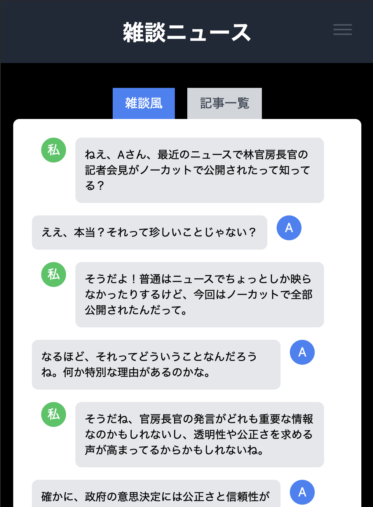
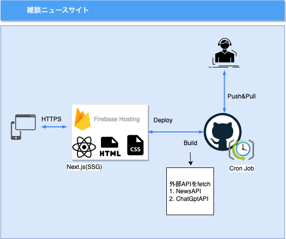

## プロジェクトの概要

- 雑談が苦手なエンジニアの雑談が苦手なエンジニアによる雑談が苦手なエンジニアのためのニュースサイト。
- 雑談風のチャット画面には各カテゴリの一番上にある記事を雑談風に変換しています。

※雑談風に変換する処理は生成AIを使ってるため情報が正しいとは限りません。間違っててもそれはそれで気軽に楽しんでください。

### サイトの外観
- URL: https://zatudan.click

### 使用技術

- インフラ
    - Firebase Hosting
- フロントエンド
    - Nextjs(SSG)
    - Typescript
- バックエンド(外部API)
    - https://newsdata.io/
    - https://platform.openai.com/docs/introduction
- cron実行
    - GitHub Actions
        - https://docs.github.com/en/actions/using-workflows/events-that-trigger-workflows#schedule

- 各バージョン
    - Node.js: v20.8.1
    - npm: v10.1.0
    - TypeScript: v5.3.3
    - Next.js: v14.0.4

### その他使用ツール一覧
- 外部API
    - [newsdata.ioのAPIKEYを取得する](https://newsdata.io/blog/how-to-get-news-api-key/)
    - [chatgptのAPIKEYを取得する](https://medium.com/@pawan329/how-to-generate-chat-gpt-api-key-daace2acc032)
- 広告
    - google adsense
- アナリティクス
    - google analytics
    - google search console